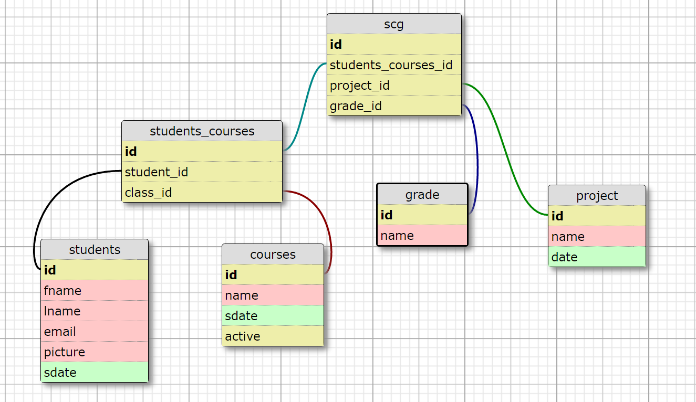
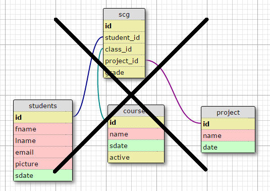

###### Story Board Objectives
+ I need to be able to enter students. I need to be able to enter a student's first name, last name, date they started the program, email address, and a link to their picture.
+ I need to be able to enter in courses, including the name and start date of the course, and if the course is active.  Notice that the design of courses is that there would be an "Intro to Programming: June" and an "Intro to Programming: August."
+ I need to be able to add student Friday projects.  Each project should have a name and due date.
+ I need to be able to Find, FindAll, DeleteAll, Save, Update, and Delete (FULL CRUD) for students, courses, and student projects.
+ I need to be able to view all students, all courses, and all projects.
+ I need to be able to add a grade for an student taking a course for a project. (_I recommend we add this method to the class Project only_).
+ When I click a specific student, I would like to see all their information, the courses that they took, and the grades they received in that course.
+ When I click a specific course, I would like to see the students, the grades of each student in the course, and the overall course average grade.
+ When I click a specific project, I would like to see all the grade for that course for any student who had taken the course, and the overall project grade average.

  **This is important:** _one way to do this project is to have one master join table query that SELECT the entire table and then we can use javascript to display the table. Then we can send this one table through the model._
+ The site does not need a login screen, unless there is extra time..
+ If extra time we can add another table for teachers.

###### Epicodus Database NEW


###### Epicodus Database OLD


###### Epicodus Database SQL
```sql


CREATE DATABASE epicodus;
GO
USE epicodus;

CREATE TABLE students (
  id INTEGER NOT NULL IDENTITY(1,1),
  fname VARCHAR(255) NULL DEFAULT NULL,
  lname VARCHAR(255) NULL DEFAULT NULL,
  email VARCHAR(255) NULL DEFAULT NULL,
  picture VARCHAR(255) NULL DEFAULT NULL,
  sdate DATE NOT NULL,
  PRIMARY KEY (id)
);

-- ---
-- Table 'courses'
--
-- ---

DROP TABLE IF EXISTS courses;

CREATE TABLE courses (
  id INTEGER NOT NULL IDENTITY(1,1),
  name VARCHAR(255) NULL DEFAULT NULL,
  sdate DATE NOT NULL,
  active INTEGER NULL DEFAULT NULL,
  PRIMARY KEY (id)
);

-- ---
-- Table 'projects'
--
-- ---

DROP TABLE IF EXISTS projects;

CREATE TABLE projects (
  id INTEGER NOT NULL IDENTITY(1,1),
  name VARCHAR(255) NULL DEFAULT NULL,
  date DATE NOT NULL,
  PRIMARY KEY (id)
);

-- ---
-- Table 'students_courses'
--
-- ---

DROP TABLE IF EXISTS students_courses;

CREATE TABLE students_courses (
  id INTEGER NOT NULL IDENTITY(1,1),
  student_id INTEGER NULL DEFAULT NULL,
  class_id INTEGER NULL DEFAULT NULL,
  PRIMARY KEY (id)
);

-- ---
-- Table 'scg'
--
-- ---

DROP TABLE IF EXISTS scg;

CREATE TABLE scg (
  id INTEGER NOT NULL IDENTITY(1,1),
  students_courses_id INTEGER NULL DEFAULT NULL,
  projects_id INTEGER NULL DEFAULT NULL,
  grade VARCHAR(255) NULL DEFAULT NULL,
  PRIMARY KEY (id)
);


DROP TABLE IF EXISTS passwords;

CREATE TABLE passwords (
  id INTEGER NOT NULL IDENTITY(1,1),
  user_name VARCHAR(255) NULL DEFAULT NULL,
  user_password VARCHAR(255) NULL DEFAULT NULL,
  PRIMARY KEY (id)
);


INSERT INTO courses (name, sdate, active) VALUES ('Intro to programming (Aug)','2016-08-01','0');
INSERT INTO courses (name, sdate, active) VALUES ('C# (Sep)','2016-09-06','1');
INSERT INTO courses (name, sdate, active) VALUES ('JavaScript (Oct)','2016-10-11','2');
INSERT INTO courses (name, sdate, active) VALUES ('.Net (Nov)','2016-11-16','2');
INSERT INTO courses (name, sdate, active) VALUES ('Internship ','2017-01-03','2');
INSERT INTO courses (name, sdate, active) VALUES ('Intro to programming (June)','2016-06-22','0');
INSERT INTO courses (name, sdate, active) VALUES ('C# (July)','2016-07-28','0');
INSERT INTO courses (name, sdate, active) VALUES ('JavaScript (Aug)','2016-08-29','0');
INSERT INTO courses (name, sdate, active) VALUES ('.Net (Sep)','2016-09-22','1');

Insert into projects (name, date) VALUES ('Portfolio', '2016-08-05');
Insert into projects (name, date) VALUES ('Choose your track', '2016-08-13' );
Insert into projects (name, date) VALUES ('Ping Pong', '2016-08-21' );
Insert into projects (name, date) VALUES ('Pizza', '2016-08-28' );
Insert into projects (name, date) VALUES ('Address Book', '2016-09-9' );
Insert into projects (name, date) VALUES ('Word Counter', '2016-09-16' );
Insert into projects (name, date) VALUES ('Hair Salon', '2016-09-23' );
Insert into projects (name, date) VALUES ('Band Tracker', '2016-09-30' );

INSERT INTO students (fname, lname, email, picture, sdate)
VALUES ('Jonathan', 'Buchner', 'me@jonathanbuchner.com', 'https://media.licdn.com/mpr/mpr/shrinknp_200_200/AAEAAQAAAAAAAAQhAAAAJDcyMzkwNzQwLTgwOGYtNDZhZS1iNjQxLTY4NDA4NTQyYjJiMA.jpg', '2016-08-01' );
INSERT INTO students (fname, lname, email, picture, sdate)
VALUES ('Note', 'Vichitra', 'Not-Available', 'https://avatars2.githubusercontent.com/u/19232053?v=3&s=400', '2016-08-01' );
INSERT INTO students (fname, lname, email, picture, sdate)
VALUES ('Ian', 'Wilcox', 'Not-Available', 'https://upload.wikimedia.org/wikipedia/commons/a/ac/No_image_available.svg', '2016-08-01' );
INSERT INTO students (fname, lname, email, picture, sdate)
VALUES ('Russ', 'Vetsper', 'Not Available', 'https://avatars.slack-edge.com/2016-06-14/50984628224_5859e6967bca456045be_512.png', '2016-08-01' );
INSERT INTO students (fname, lname, email, picture, sdate)
VALUES ('Rouz', 'Majlessi', 'Not Available', 'https://pbs.twimg.com/profile_images/3748163517/30900ad24d146fc561bb65c6f96a490e_400x400.jpeg', '2016-06-23' );


INSERT INTO students (fname, lname, email, picture, sdate)
VALUES ('Yi', 'Chiang', 'Not Available', 'https://avatars0.githubusercontent.com/u/17328624?v=3&s=466', '2016-06-23' );
INSERT INTO students (fname, lname, email, picture, sdate)
VALUES ('Steven', 'Tran', 'Not Available', 'https://avatars0.githubusercontent.com/u/19356994?v=3&s=400', '2016-06-23' );
INSERT INTO students (fname, lname, email, picture, sdate)
VALUES ('Joel', 'Wage',  'Not Available', 'http://www.villagetheatre.org/Graphics/kidstage/Instructors/Joel-Waage.jpg', '2016-06-23' );
INSERT INTO students (fname, lname, email, picture, sdate)
VALUES ('Russ', 'Davies', 'No', 'https://upload.wikimedia.org/wikipedia/commons/a/ac/No_image_available.svg', '2016-06-23' );
INSERT INTO students (fname, lname, email, picture, sdate)
VALUES ('Andrew', 'Niekamp',  'Not Available', 'https://media.licdn.com/mpr/mpr/shrinknp_200_200/AAEAAQAAAAAAAAICAAAAJDVlYTVlNDU4LTIyMTQtNDczZi04NmIzLTdmMTkzZmY3ZTQ4NQ.jpg', '2016-06-23' );

-- ---
-- Foreign Keys
-- ---

--ALTER TABLE students_courses ADD FOREIGN KEY (student_id) REFERENCES students (id);
--ALTER TABLE students_courses ADD FOREIGN KEY (class_id) REFERENCES courses (id);
--ALTER TABLE scg ADD FOREIGN KEY (students_courses_id) REFERENCES students_courses (id);
--ALTER TABLE scg ADD FOREIGN KEY (projects_id) REFERENCES projects (id);

-- ---
-- Table Properties
-- ---

-- ALTER TABLE students ENGINE=InnoDB DEFAULT CHARSET=utf8 COLLATE=utf8_bin;
-- ALTER TABLE courses ENGINE=InnoDB DEFAULT CHARSET=utf8 COLLATE=utf8_bin;
-- ALTER TABLE project ENGINE=InnoDB DEFAULT CHARSET=utf8 COLLATE=utf8_bin;
-- ALTER TABLE students_courses ENGINE=InnoDB DEFAULT CHARSET=utf8 COLLATE=utf8_bin;
-- ALTER TABLE scg ENGINE=InnoDB DEFAULT CHARSET=utf8 COLLATE=utf8_bin;

-- ---
-- Test Data
-- ---

-- INSERT INTO students (id,fname,lname,email,picture,sdate) VALUES
-- ('','','','','','');
-- INSERT INTO courses (id,name,sdate,active) VALUES
-- ('','','','');
-- INSERT INTO projects (id,name,date) VALUES
-- ('','','');
-- INSERT INTO students_courses (id,student_id,class_id) VALUES
-- ('','','');
-- INSERT INTO scg (id,students_courses_id,projects_id,grade) VALUES
-- ('','','','');
```

Short Term Save

INSERT INTO SCG (students_courses_id, projects_id, grade) VALUES (118, 33);

Student student = new Student();
student.Save();

Course course = new Course();
course.Save().;

course.Add(student)

Project project = new Project();
project.Save();
//ACT
Project.Add(Student,Course, "Grade");

public void Add(Student student, Course course, string grade)
{
OpenSQLCONN

SELECT students_courses.id FROM students JOIN students_courses
ON students.id = students_courses.student_id JOIN courses
ON courses.id = students_courses.class_id
WHERE students.id = 118;

sql parameter student_id
sql parameter course_ID
WHile()


ID

INSERT INTO SCG (student
